## Instrumenting Kubernetes with Dynatrace

In this exercise we will install the Dynatrace Operator.

### 1. Deploy Dynatrace

1. In Dynatrace tenant select "Deploy"

   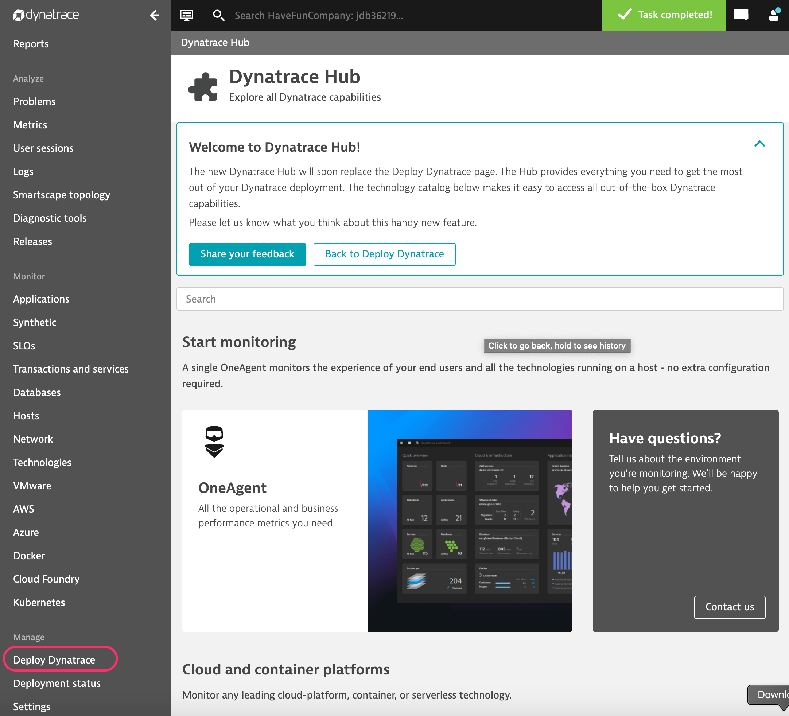

2. Search for kubernetes
   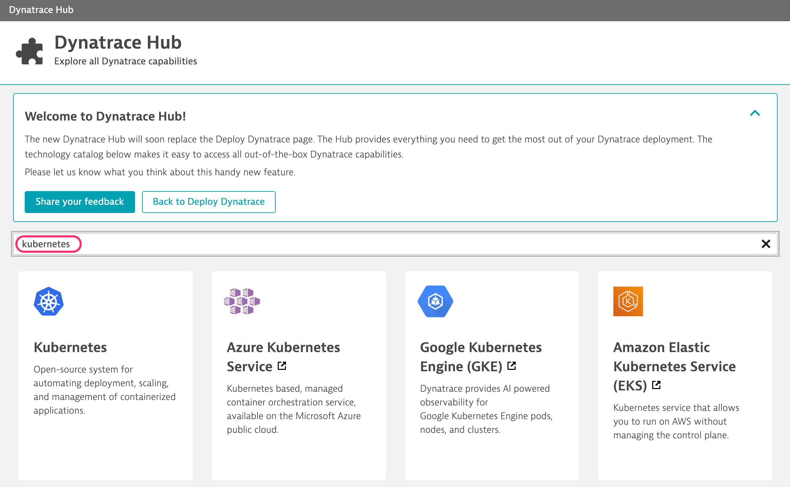

3. Click on Kubernetes tile from above
   

4. Click on Monitor Kubernetes
   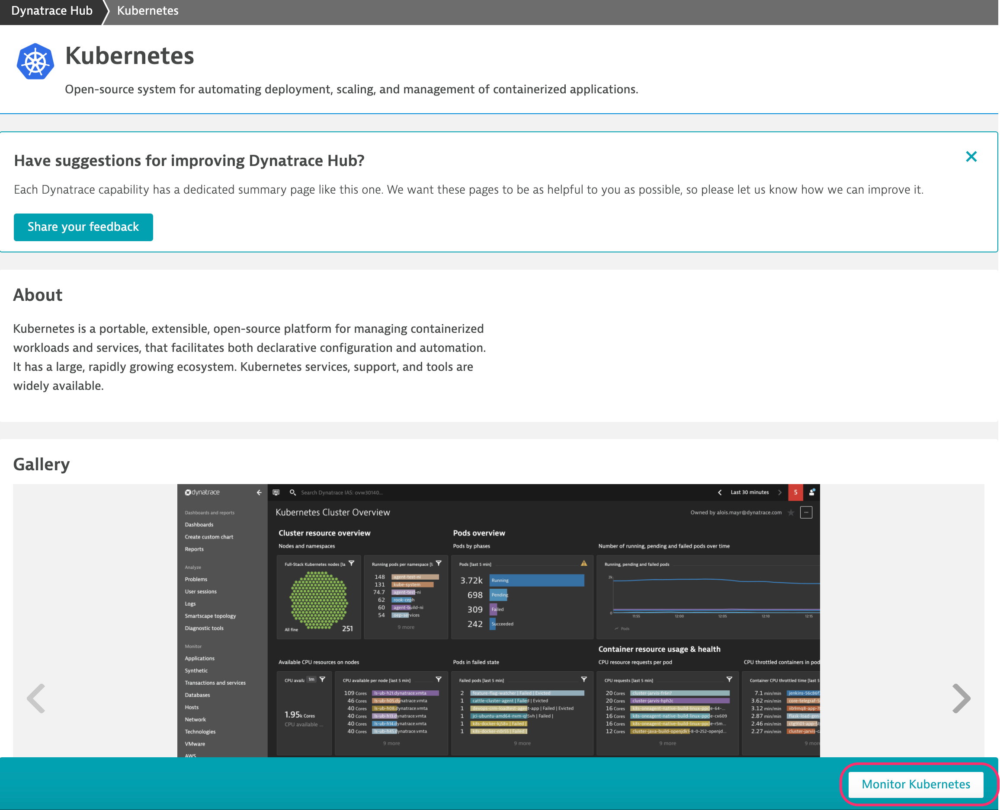

5. Click Create PaaS token

   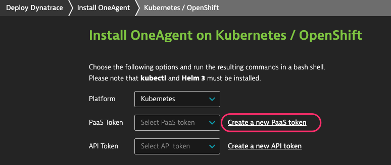

   - After creating the PaaS token follow the step 1-3 above to get back to this screen.

6. Create API token

   

   - After creating the PaaS token follow the step 1-3 above to get back to this screen.

7. Select the PaaS and API tokens you created above

   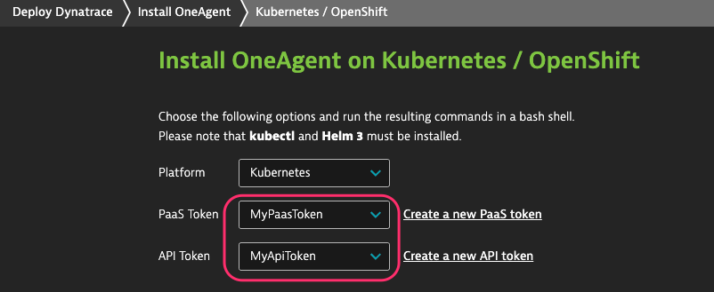

8. Click the Copy Button

   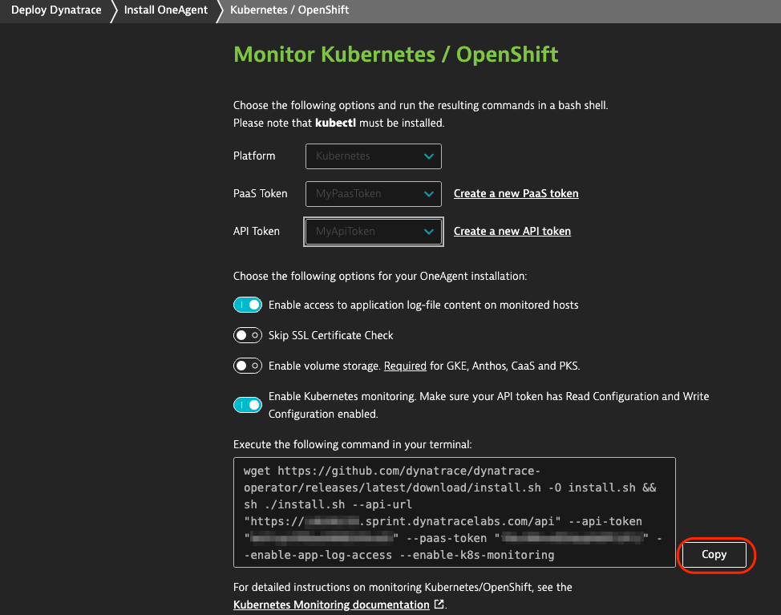

9. Run Script on Bastion host

   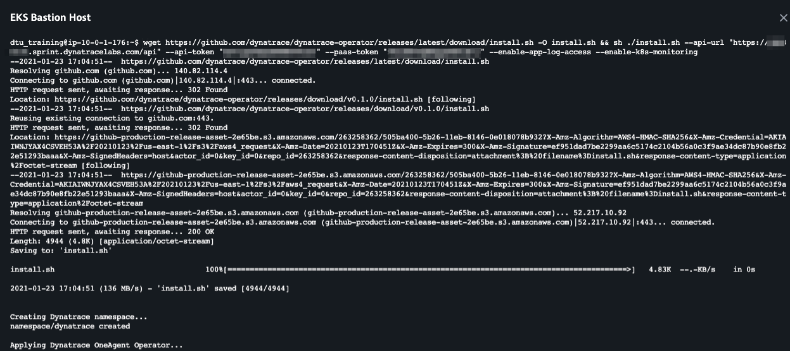
   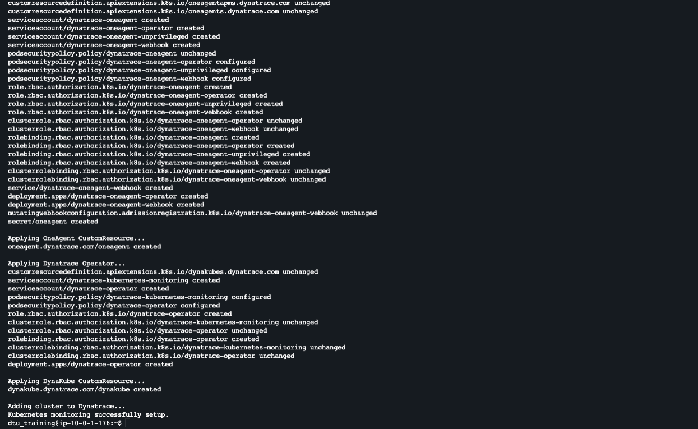

### 2. Update Kubernetes Integration Settings
1. In Dynatrace Tenant, Click Settings -> Cloud and Virtualization -> Kubernetes

   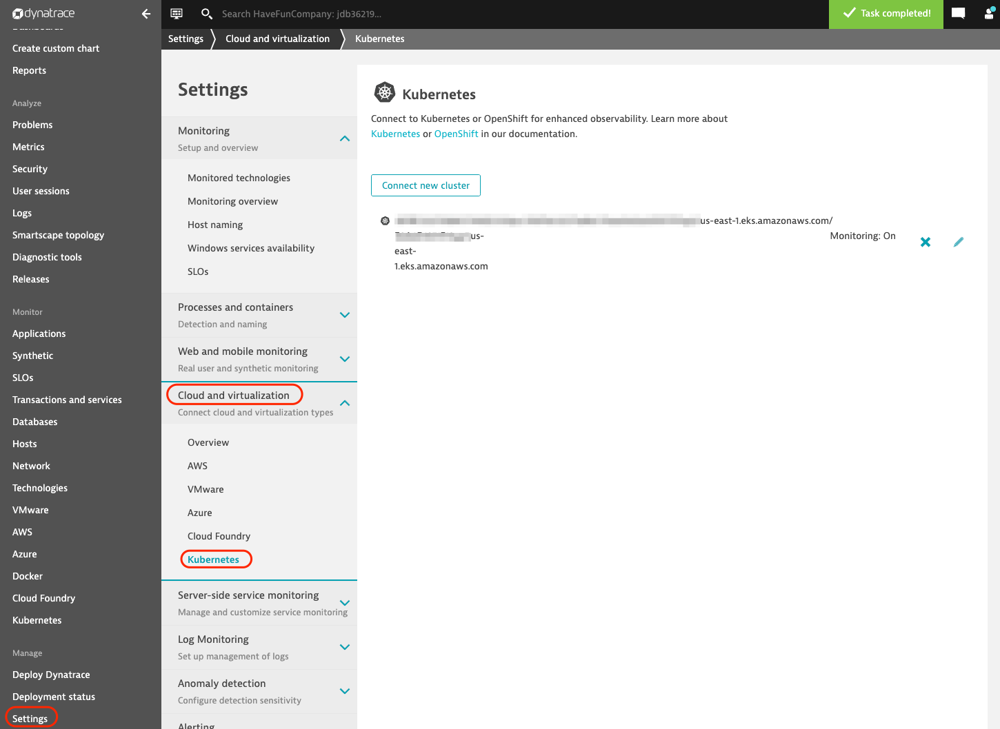

2. Click on the Edit icon for the configured K8S clustername

         

3. Set the toggle switches
   - Toggle off "Require valid certificates for communication with API server". This is because the workshop k8s cluster are using self signed certificates.

   - Toggle on "Monitor Prometheus exports"
   

4. Click Add event field selector
   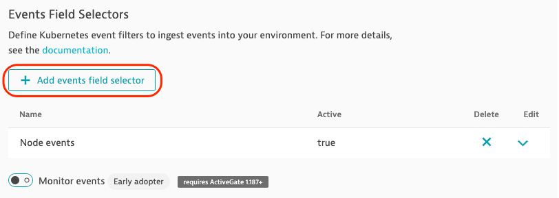

5. Add a field selector name and expression

   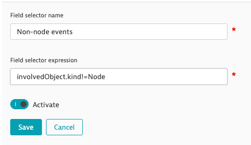

   - Click Save.

6.  Toggle on Monitor events

   

7. Click Save.   
