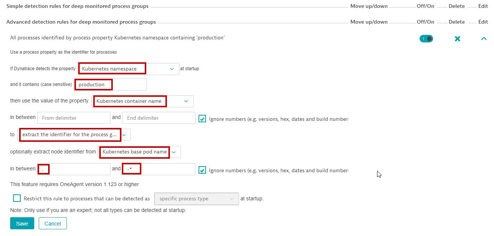
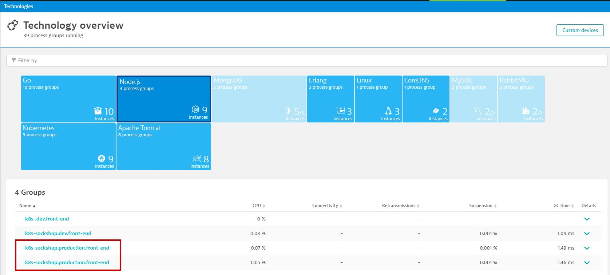
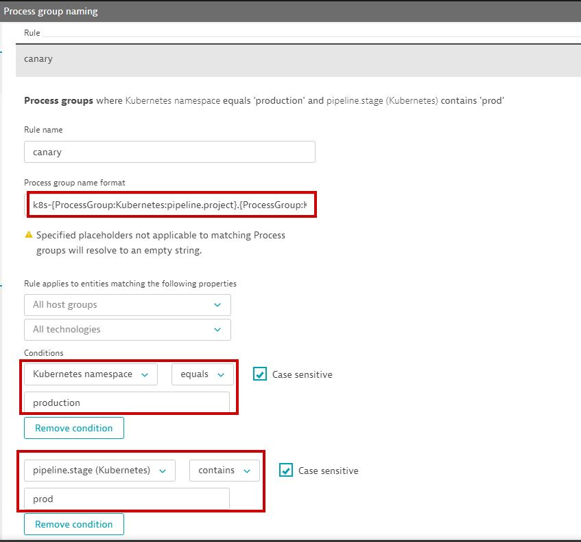
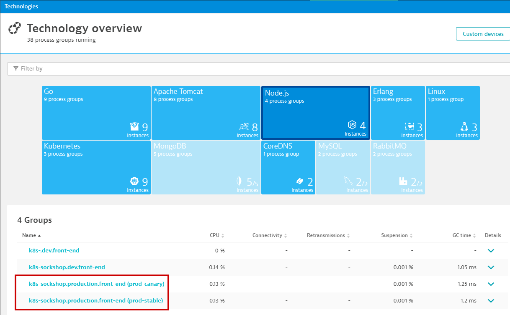
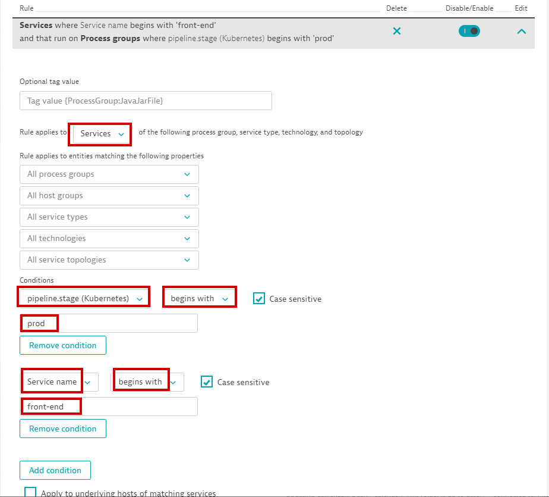

## Process Detection for Canary Deployment

### 1. Deploy the Canary Release 

```bash
 ./deploy-canary.sh
```

Execute <b>kubectl get pods -n production -o wide</b> and you will see you now have both <b>stable and canary releases running for the front-end service</b>


Wait 1-2 minutes then look the Services in Dynatrace. You have 2 services in production, one for stable and one for canary release.
For monitoring purposes, it should be the same service


### 2. Process Detection Rule Config

In the Dynatrace console, go in Settings -> Processes and containers -> Process group detection.

Expand the <b>Process detection rules</b> section. 

Click <b>Add detection</b> rule.

Select Use a process property


We want to apply this rule for pods running in production only (namespace=production)

Also, extract the identifier after the "." in the pod name. 
Remember the pod names have ".stable "or ".canary" in their name to distinguish them



Recycle both stable and canary frontend pods. The process detection rules are applied on process startup.

<b>./recycle-sockshop-frontend-production.sh </b>

Make sure the pods are ready 

<b>kubectl get deployments -n production -l tier=frontend</b>

Within Dynatrace, you can see that the two Process Groups "k8s-sockshop.production.front-end" have been created with each process group having either the canary instance or stable instance.




### 3. Process Group Naming Rule Config

In the Dynatrace console, go in Settings -> Processes and containers -> Process group Naming.

Click <b>Add New Rule</b>.

Create a process group naming rule to include "prod.canary/stable" at the end of the process group name to make it easier to identity process group. Specify the process group naming format to <b>k8s-{ProcessGroup:Kubernetes:pipeline.project}.{ProcessGroup:KubernetesNamespace}.{ProcessGroup:KubernetesContainerName} ({ProcessGroup:Kubernetes:pipeline.stage})</b>




Make sure the new rule is the first rule:


The new process group name should appear as below format:



### 3. Create automatic tagging rule (to tag frontend service with pipeline stage =prod.*)

In the Dynatrace console, go in Settings -> Tags -> Automatically applied tags

Click <b>Add a new Rule</b>.

Define the tagging rule as below:


:arrow_up: [Back to TOC](/README.md) :arrow_left: [Prev](../la6/README.md) 


